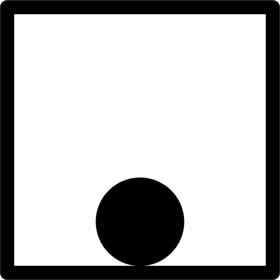
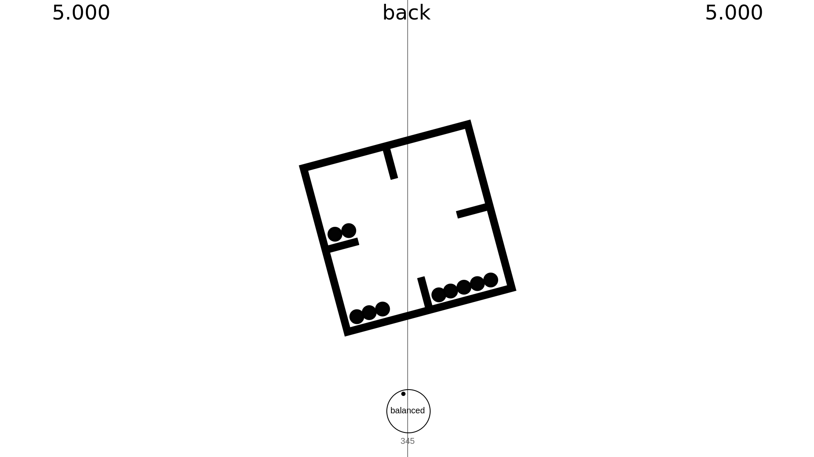

  

<h1>Balance ⚫</h1>

  Balance is a concept demo game where your objective is to maintain the equilibrium of balls within a designated domain.

## 
⚠️ Work in Progress 🏗️

  This game is currently under development. Expect updates and improvements as it progresses!

## 
How to Play 🔲

 ·Use your mouse to repel the balls or the mouse wheel to rotate the container·
 ·Achieve balance for 5 seconds to complete each level·
 ·Challenge yourself to complete all three levels as quickly as possible·
  

  

## 
Motivation ➖

  This project was created to:

     ·Clean my rusty JavaScript programming skills·
     ·Experiment with physics-based gameplay mechanics·
     ·Develop a simple concept game·

## 
Acknowledgments ⚖️

  This project was initially inspired by the work of <a href="https://github.com/zalo" target="_blank">Johnathon Selstad</a>

  Kudos to his great <a href="https://zalo.github.io/blog/constraints/" target="_blank">demo page</a> and, specifically, to his <a href="https://github.com/zalo/zalo.github.io/blob/master/assets/js/Constraints/VerletCollision.js" target="_blank">Verlet Collision</a> code 🤙

